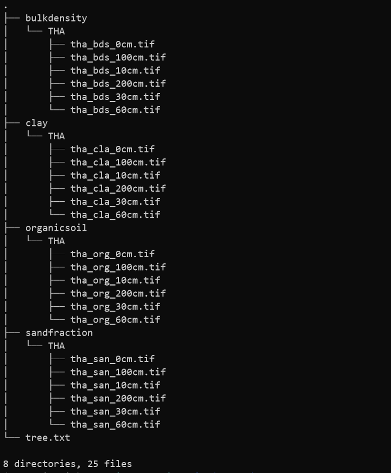
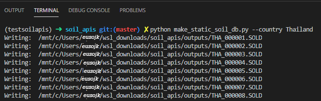
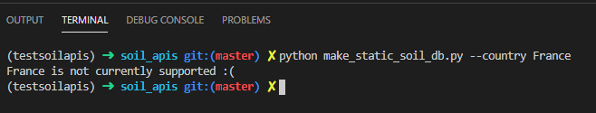
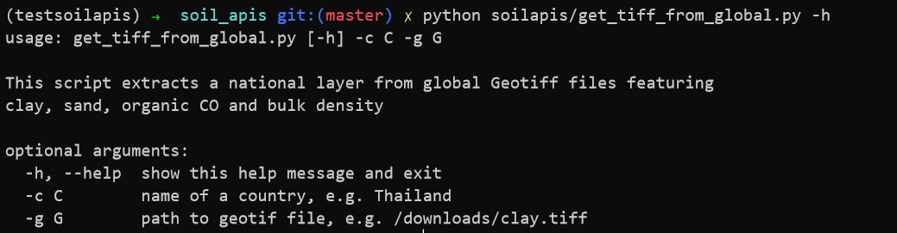

soilapis: Creating .SOL database (DSSAT) and TAW files (SWB)
========


Requirements:
---
This module requires Gfortran and should be run on a UNIX based OS.
If you are on Ubuntu, you can install some utilities like this:
```
    sudo apt-get install build-essential gfortran wget
```


Dependencies:
---
1. Create new venv and Install all the dependencies:
```
    conda create -n testsoilapis python=3.7
    conda activate testsoilapis
    pip install -r https://raw.githubusercontent.com/eusojk/soil_apis/master/requirements.txt
```
2. Fix GDAL's build errors with conda-forge:
```
    conda install -c conda-forge gdal
```
3. Finally install module:
```
    pip install https://github.com/eusojk/soil_apis/blob/master/soilapis.zip?raw=true
```
4. Clone this project:
```
    git clone https://github.com/eusojk/soil_apis/
```
5. Run the executable to compile the required fortran scripts:
```
    bash compilef90.sh 
```
6. Still in your *soil_apis* directory, download the soilproperties file and unzip it:
```
    wget https://www.dropbox.com/s/41acfpzh782a2kh/soilproperties.zip
    unzip soilproperties.zip
```
7. The hierarchy of the *soilproperties* directory should like this:




---
A. How to create a static .SOL file (DSSAT)?
===

The countries currently supported are: 
* Cambodia (KHM)
* Laos (LAO)
* Myanmar (MNM)
* Thailand (THA)
* Vietnam (VNM)

**Make sure your virtual python environment is installed and activated before proceeding**

1. Go to the project directory if not there already
2. Run the script by providing the name of country of interest:
```
    python make_static_soil_db.py --country Thailand
```
**P.S. Running the script above would take some time!**

3. Examples of some simulations run in visual code:
    *
    3.a. After successful iterations of .SOLD, you will get a **.SOL** at the end
        
        *

    3.b. Some countries are not natively supported:
        
        *

    3.c If Running in the terminal, you may get some Backtrace warnings from Fortran. 
    These seem to be 'EOF' errors but won't impact the success of the script :) 
    * 
4. How do I run *make_static_soil_db.py* for the other countries (e.g. KHM, LAO, etc.)? \
    *
    Remember the *soilproperties* directory from above? Model the structure of the folder and create/add the individual GTiff directory for additional countries.
    *
    4.1. Prepare your layer: extracting from a global GTiff file:
    

    For example, to extract GTiff for Cambodia from the global organic GTiff life:
    ```
        python soilapis/get_tiff_from_global.py -c Cambodia -g ../organic_60cm.tif
    ```
    The output will be:
    >
    > _extraction terminated. Output: /pathto/soil_apis/KHM_organic_60cm.tif_
    >


    4.2. After preparing all your layers using the script above. Copy them to the *soilproperties* directory like we did for **"THA"**. 


---
B. How to create a dynamic .SOL file (SWB)?
===

### B.1. Usage - As a Python Module:
<!-- --- -->

**Make sure your virtual python environment is installed and activated before proceeding**

```
from soilapis.calculator import SoilConnector
```
- extract the total available water (TAW) value from soil layers. E.g:
```
soil_conn = SoilConnector(path/to/soilproperties)
soil_taw = soil_conn.get_total_available_water(103.84, 15.76, 500, 3)
print(soil_taw)
```
- create appropriate dynamic or static soil database (.SOL) as an input for DSSAT 
```
soil_conn = SoilConnector(path/to/soilproperties)
soil_dssat = soil_conn.get_soil_property(103.84, 15.76, 500, 3, "dssat")
print(soil_dssat)
```


### B.2. Usage - As a CLI:
<!-- --- -->

**Make sure your virtual python environment is installed and activated before proceeding**

1. Go to the location of the script

```
cd /path/to/soil_apis/soilapis
```

2. Main usage:
```
summary_soil_property.py [-h] --lon LON --lat LAT --win WIN --depth DEPTH  [--format FORMAT]
```

3. To get help:

```
summary_soil_property.py -h
```

4. For example, to get TAW file needed to to run the soil water balance:
```
python path/to/summary_soil_property.py --lon=103.84 --lat=15.76 --win=3 --depth=350
```

5. For example, To retrieve the .SOL file needed to to run DSSA:
```
python summary_soil_property.py --lon=103.84 --lat=15.76 --win=3 --depth=500 --format=dssat
```


Some References:
---

The _SoilTAW[Depth]mm.csv_ output file contains three entries needed for Soil Water Balance:
* _codeID_: this is just a unique ID for the TAW value. It's an integer
* _Soil type_: This is used by the water balance model to link a computational unit with the data. Possible values are: SiltLoam, SAND, SiltClayL, Loam, ClayLoam, SandyLoam, etc...
* _TAW_: this is a float value corresponding to the TAW calculated by the script. This value is in mm


TODO
---
- Fix Fortran EOF warnings when script run in terminal
- Output .SOL file as json
